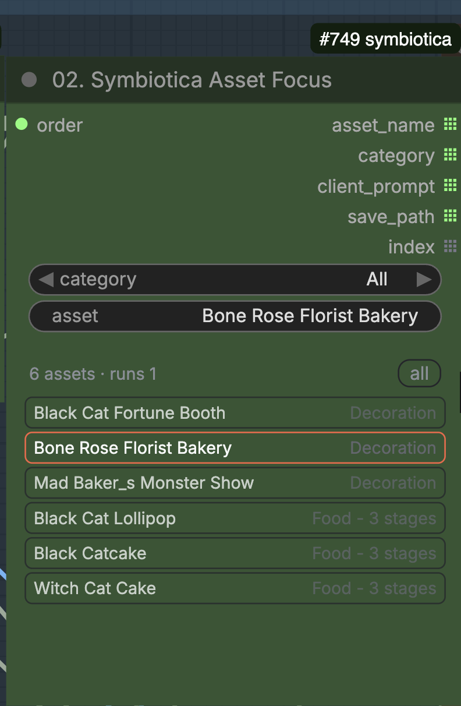
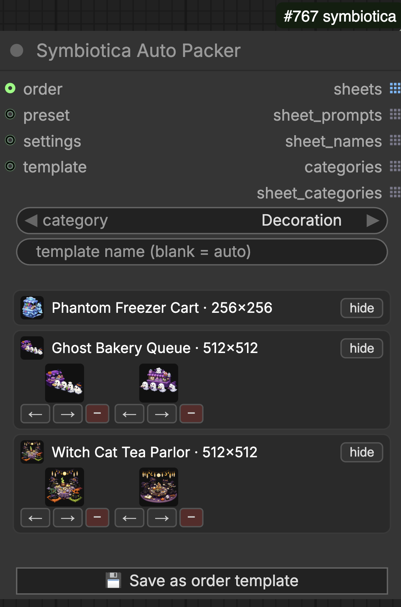
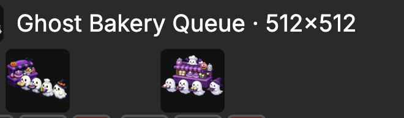
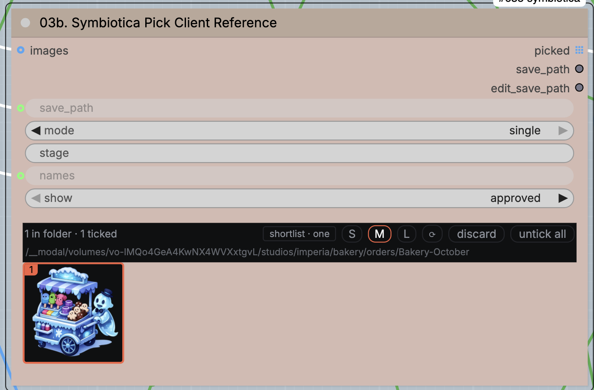

# Roadmap

Ideas queued for the pack. One block per idea, numbered by its GitHub issue —
refer to an entry as #N. Move a block to the CHANGELOG when it ships.

## [#65](https://github.com/symbiotica-ai/comfyui-nodes/issues/65) — Order Tracker Node

Track the progression of the order, gamify it.

- Data already exists: `parse-order` returns per-asset `status` (1 / 0.75 / 0),
  and approved renders land under the asset's save path — so per-event and
  per-month completion is computable with no new bookkeeping.
- Show progression in-graph: counts per event (done / in progress / not
  started), a per-month progress bar, maybe the current asset highlighted.
- Gamify: streaks (assets approved today), a running % for the month, a
  finish-line callout when an event hits 100%.
- Demo the gamified creation flow: a short run on a real month's order showing
  progression ticking up as assets get approved — the pitch artifact for the
  feature.

## [#64](https://github.com/symbiotica-ai/comfyui-nodes/issues/64) — Asset Focus: reference thumbnails in the asset list

Reuse the Auto Packer panel's row rendering for the Asset Focus list — the
thumbnail machinery already exists (`order_pipeline.js`: `thumbUrl` over the
`/symbiotica/ref-image` route, refs root registered by the order run).

- Row format, per asset:
  `Title · resolution` (canvas from the order row), then the reference
  thumbnails underneath — first ref, second ref if any.
- No reorder arrows and no hide toggle — those are packer concerns; this list
  only picks the focus.

| Asset Focus today | Auto Packer rows to borrow | Target row format |
|---|---|---|
|  |  |  |

## [#66](https://github.com/symbiotica-ai/comfyui-nodes/issues/66) — Render lane: use / don't use reference image

Generate with or without a client reference. The architect chat's `image`
comes from the Pick Client Reference node; an asset with no client refs (or a
deliberately empty pick) should still compose and render — a use/don't-use
switch, or an empty pick simply meaning "no reference".

## [#67](https://github.com/symbiotica-ai/comfyui-nodes/issues/67) — Preload models at workflow start

Load the diffusion model, VAE, controlnets, CLIP and loras at workflow start
instead of at first queue — the GPU is paid for whether it renders or not, so
warm it while the user is still picking assets and writing prompts. First
generation should not carry the cold-load penalty.
